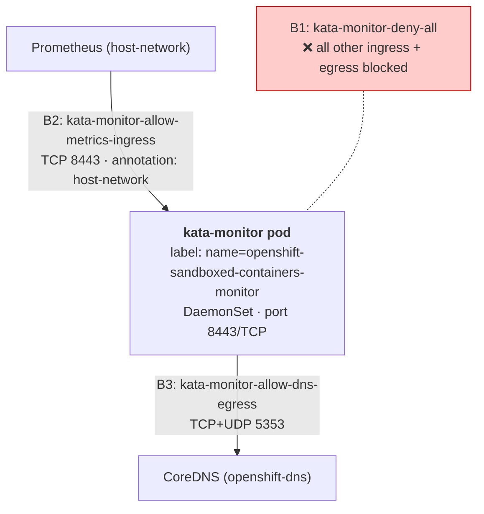
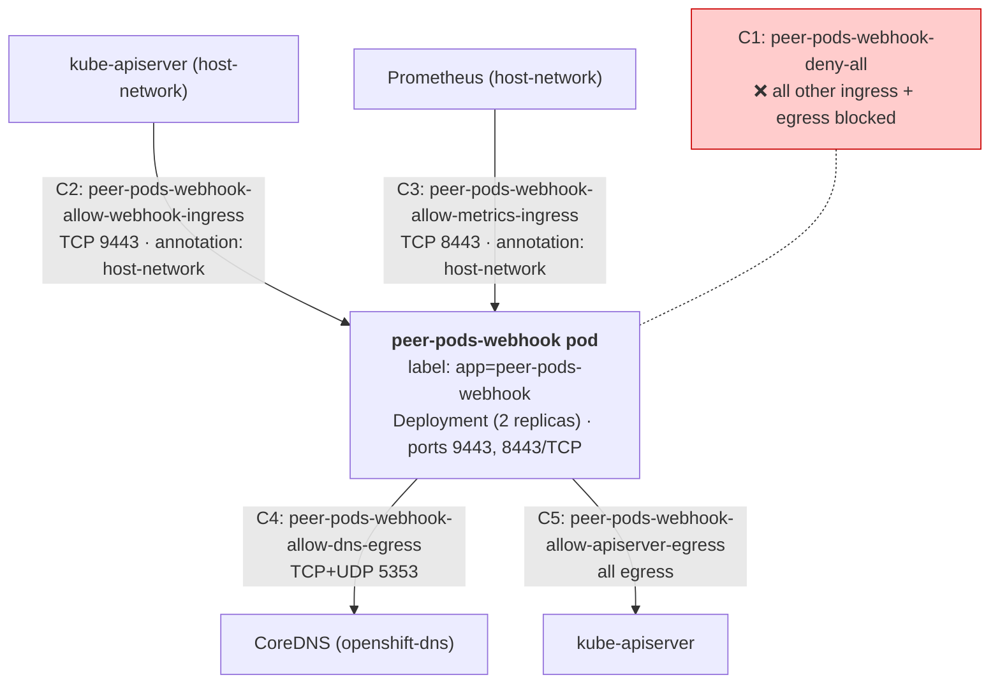
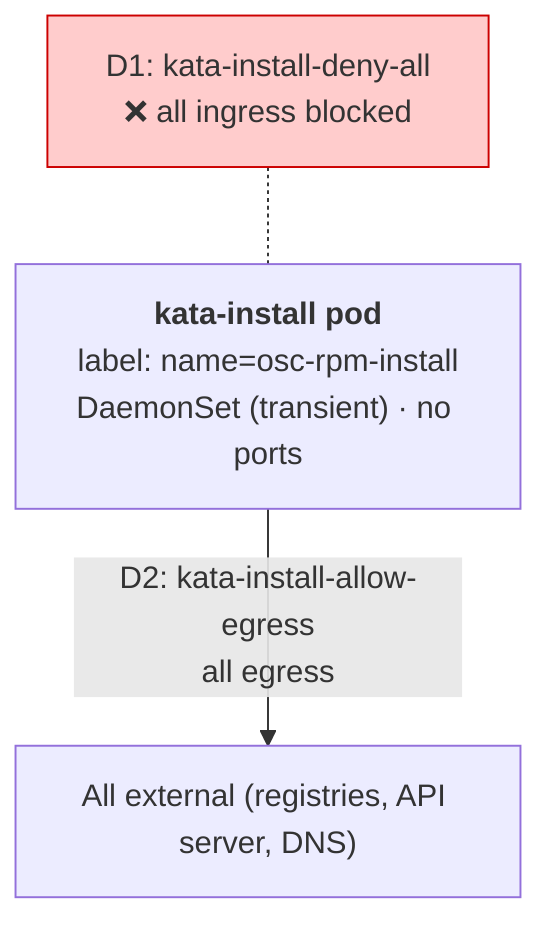
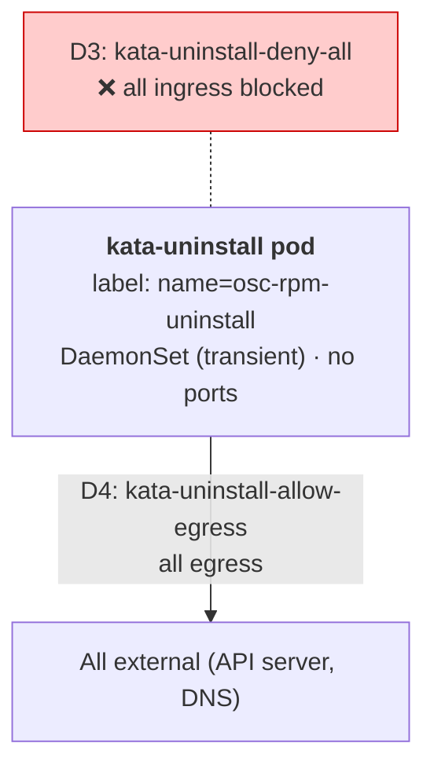
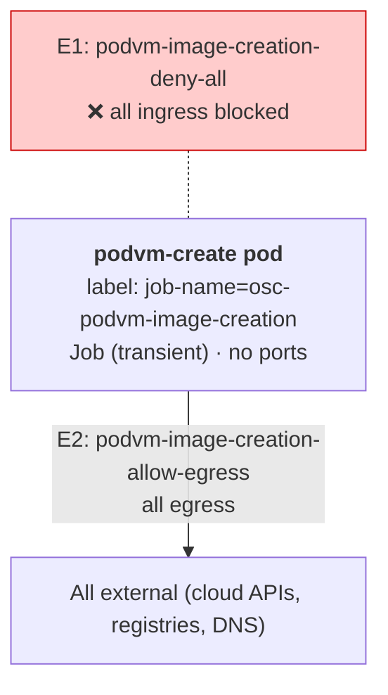
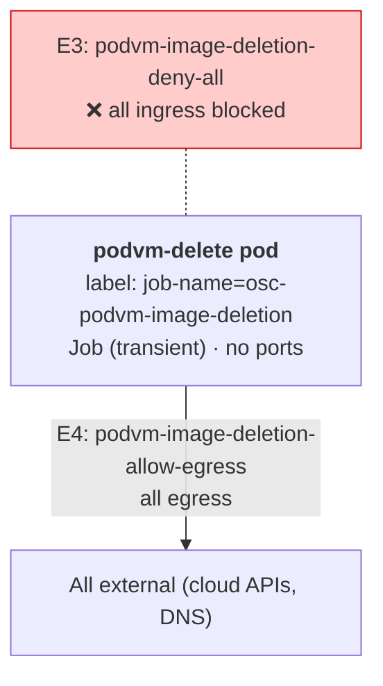
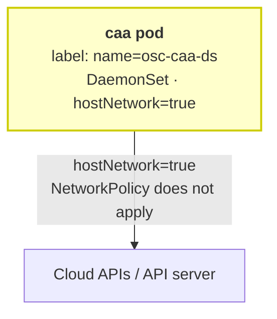
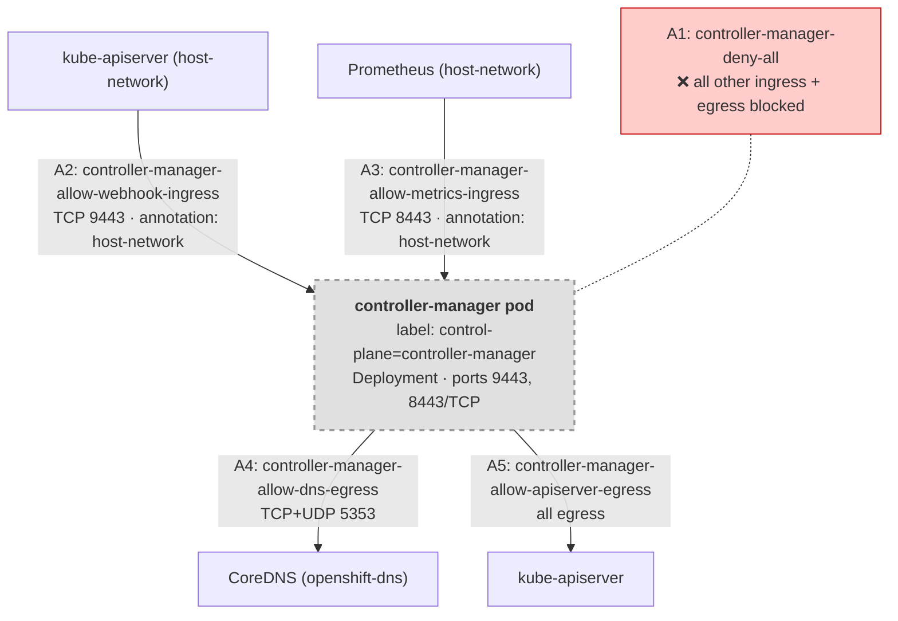

# OSC Network Policies — Component by Component

## kata-monitor (3 NPs)

## peer-pods-webhook (5 NPs)

## kata-install (2 NPs)

## kata-uninstall (2 NPs)

## podvm-image-creation (2 NPs)

## podvm-image-deletion (2 NPs)

## cloud-api-adaptor — NO NPs

## controller-manager — Phase 2 OLM bundle (pending)

